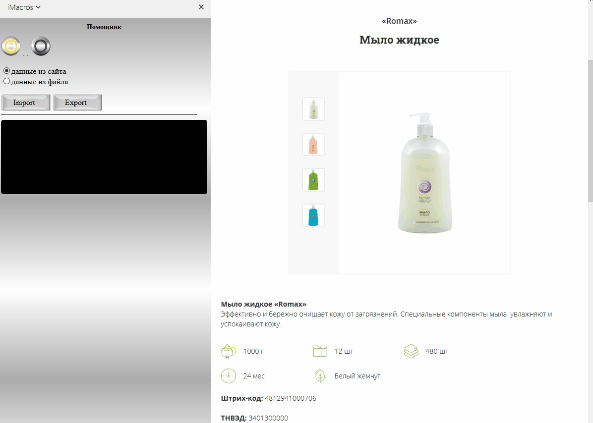

# Скрипты на JavaScript

* [Добавление алиасов](#Добавлениеалиасов)
* [Расширение функционала](#Расширение-функционала)
* [Рекомендации с предыдущего места работы](#Рекомендации-с-предыдущего-места-работы)

Ниже приведены примеры моих первых скриптов на языке JavaScript. Скрипты предназначены для автоматизации работы оператора. Эта работа предполагает создание/изменение каталога товаров в бэкофисе крупного сайта.

## Добавление алиасов.

Работа оператора заключается в обработке запросов от магазинов. Каждая строка таблицы - отдельный запрос. Цель - найти в имеющемся каталоге запрашиваемый магазином товар и поместить в него алиас (участок текста из запроса, содержащий параметры текущего товара).

<b>Как выглядела работа без скрипта</b> <i>(воспроизведение начнется через 10 секунд...)</i>

	

Что было сделано?
- добавлен более информативный и удобный пользовательский интерфейс в окне расширения iMacros.
- добавлен фильтр на основе регулярных выражений, который выполняет поиск в текущем каталоге. Пользователю остается лишь проверить правильность результатов его работы.
- добавлен дополнительный функционал: кнопки, панели, интерактивные сообщения, которые ускоряют работу оператора.

<b>Работа со скриптом</b>
 
	

	Итого:
	- Благодаря внедрению скрипта удалось сократить время обработки запроса с 17 сек до 3 сек (примерно в 5 раз).
	- Создан более удобный в использовании интерфейс пользователя.
	- Создана платформа для дальнейшего расширения функционала скрипта.
	- Полученные знания бесценны.

## Расширение функционала

На базе описанного выше проекта затем были созданы ряд менее значительных, как, например, подобный парсер параметров товара:

Парсер параметров товара для конкретного сайта

	

 

## Рекомендации с предыдущего места работы

Благодарю своих руководителей за положительную оценку моих трудов. Для получения контактов прошу писать в личку.

Recommendation

	

